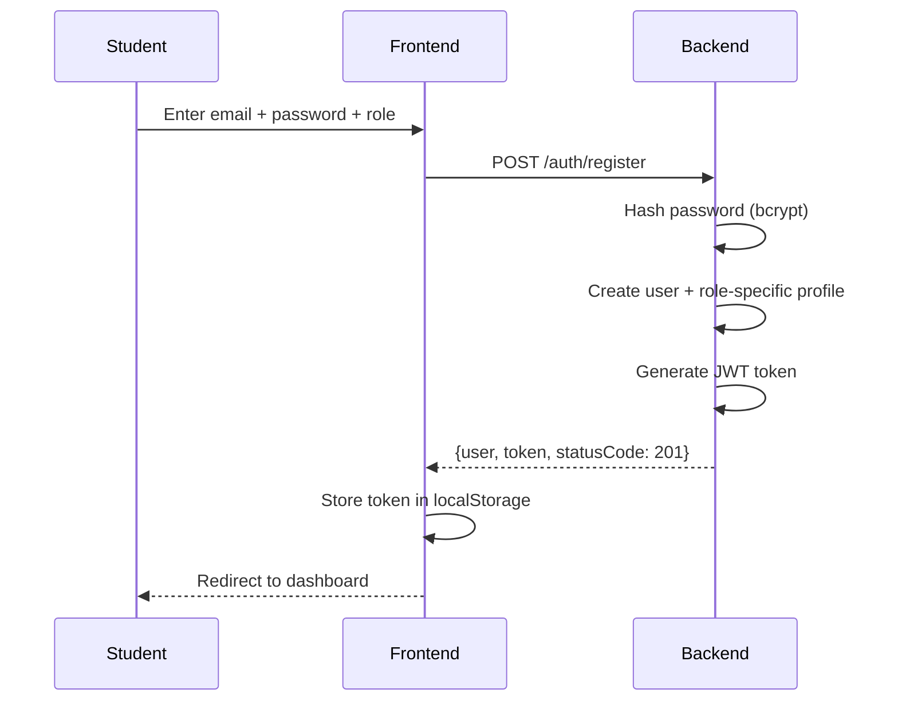
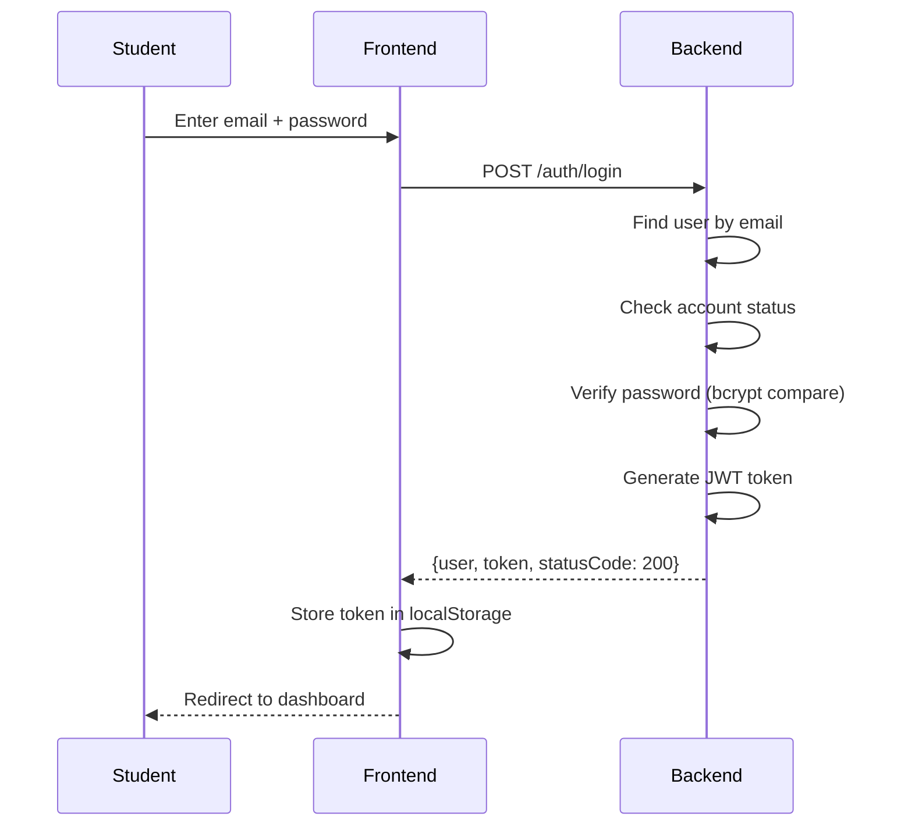
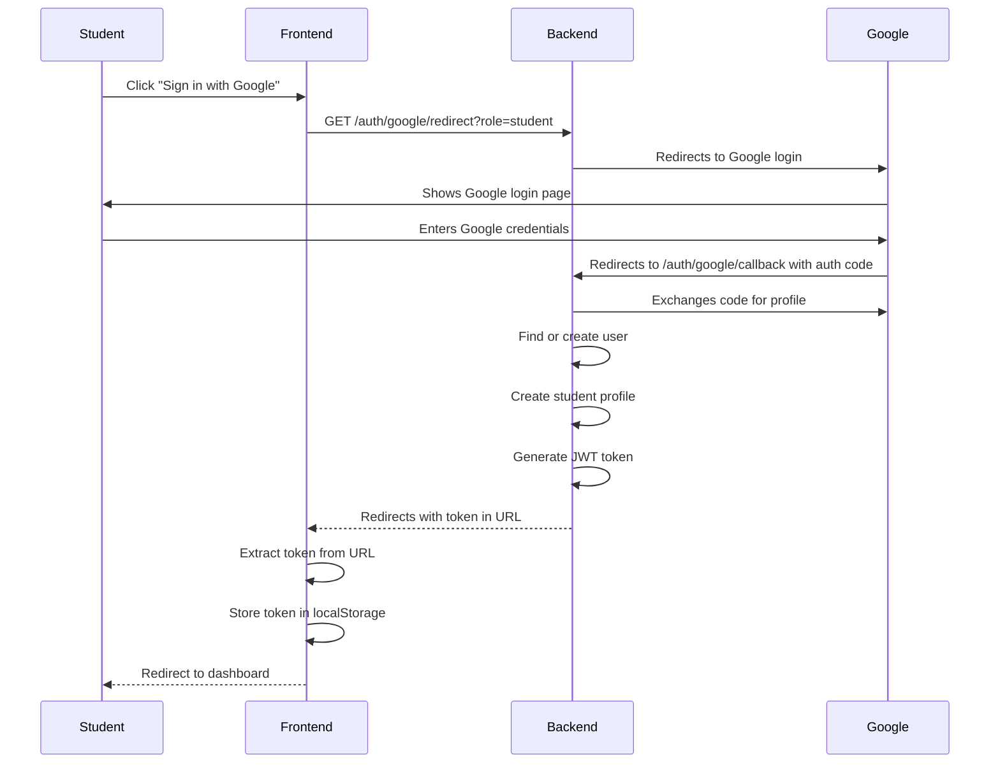
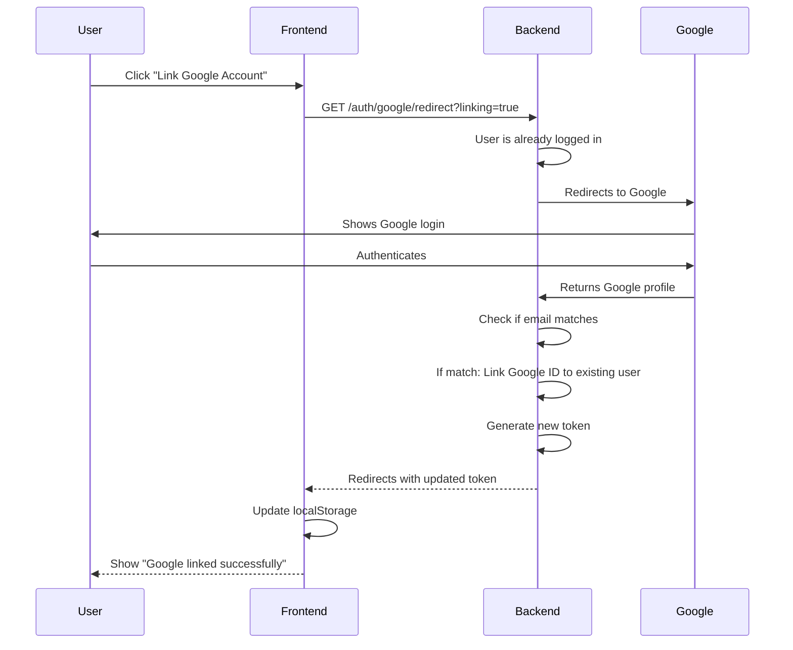

# Frontend Developer Integration Guide

**Status:** Complete Reference for React/Netlify Frontend  
**Version:** 2.1.0  
**Updated:** April 14, 2026  
**Target:** React Developers using this API

---

## Table of Contents

1. [Getting Started](#getting-started)
2. [Error Handling Strategy](#error-handling-strategy)
3. [Authentication Flows](#authentication-flows)
4. [Rate Limiting & Account Lockout](#rate-limiting--account-lockout)
5. [Data Flow Diagrams](#data-flow-diagrams)
6. [Common Workflows](#common-workflows)
7. [Session Management](#session-management)

---

## Getting Started

### Base URL

```
Development: http://localhost:5000/api
Production: https://ojt-system-v2-backend-nodejs.vercel.app/api
```

### Authentication Header

All protected endpoints require:

```javascript
headers: {
  'Authorization': `Bearer ${token}`,
  'Content-Type': 'application/json'
}
```

### Store JWT Token

```javascript
// After successful login/register
localStorage.setItem('ojt_token', response.token);

// On every API request
const token = localStorage.getItem('ojt_token');
```

---

## Error Handling Strategy

### HTTP Status Codes Explained

| Code | Meaning | What Frontend Should Do |
|------|---------|------------------------|
| **200** | OK | Request succeeded, data in response |
| **201** | Created | Resource created successfully |
| **400** | Bad Request | Fix request body (validation error) |
| **401** | Unauthorized | Missing/invalid token - redirect to login |
| **403** | Forbidden | User lacks permission - show access denied |
| **404** | Not Found | Resource doesn't exist - show not found page |
| **409** | Conflict | Duplicate data or business logic error - don't retry |
| **422** | Unprocessable Entity | Validation failed - show form errors to user |
| **423** | Locked | Account locked (too many login attempts) - show countdown |
| **429** | Too Many Requests | Rate limited - wait and retry |
| **500** | Server Error | Show "Something went wrong" - don't retry immediately |

### Error Response Format

```javascript
{
  "message": "Account temporarily locked. Try again in 28 minutes",
  "statusCode": 423,
  "timestamp": "2026-04-14T10:30:00Z",
  "errorCode": "ACCOUNT_LOCKED"  // Machine-readable error type
}
```

### Frontend Error Handling Example

```javascript
async function apiCall(endpoint, options = {}) {
  try {
    const response = await fetch(`${API_BASE}${endpoint}`, {
      headers: {
        'Authorization': `Bearer ${localStorage.getItem('ojt_token')}`,
        'Content-Type': 'application/json',
        ...options.headers
      },
      ...options
    });

    if (!response.ok) {
      const error = await response.json();
      
      // Handle specific errors
      switch (response.status) {
        case 401:
          // Token expired or invalid
          localStorage.removeItem('ojt_token');
          window.location.href = '/login';
          throw new Error('Session expired. Please login again');
          
        case 423:
          // Account locked
          throw new Error(error.message); // Shows countdown to user
          
        case 409:
          // Conflict - don't retry automatically
          throw new Error(error.message);
          
        case 429:
          // Rate limited - show message, don't retry immediately
          throw new Error('Too many requests. Please wait before trying again');
          
        default:
          throw new Error(error.message || 'API error');
      }
    }
    
    return await response.json();
  } catch (error) {
    console.error('API Error:', error);
    throw error;
  }
}
```

---

## Authentication Flows

### Flow 1: Email/Password Registration & Login



### Flow 2: Email/Password Login



**Errors:**
- 401: Invalid email or password
- 423: Account locked (after 5 failed attempts for 30 min)
- 403: Account pending/suspended/inactive
- 422: Validation failed

### Flow 3: Google OAuth Login



**What Frontend Does:**
1. User clicks "Sign in with Google" button
2. Redirect to: `https://ojt-system-v2-backend-nodejs.vercel.app/api/auth/google/redirect`
3. Backend redirects to Google
4. After Google auth, backend redirects back to frontend with token: `?token=JWT_TOKEN`
5. Extract token from URL: `const token = new URLSearchParams(window.location.search).get('token')`
6. Store token and redirect to dashboard

### Flow 4: Account Linking (Existing User + Google)



---

## Rate Limiting & Account Lockout

### Account Lockout (Brute Force Protection)

**When it triggers:** 5 failed login attempts in quick succession

**What happens:**
1. User locked for 30 minutes
2. Backend returns HTTP 423 (Locked) status
3. Error message: "Account locked. Try again in X minutes"
4. After 30 minutes: Automatically unlocked, attempts reset

**Frontend Implementation:**

```javascript
async function login(email, password) {
  try {
    const response = await apiCall('/auth/login', {
      method: 'POST',
      body: JSON.stringify({ email, password })
    });
    // Success - store token
    localStorage.setItem('ojt_token', response.token);
  } catch (error) {
    if (error.statusCode === 423) {
      // Account locked - show countdown
      const remaining = extractRemainingMinutes(error.message);
      showLockoutTimer(remaining);
      // IMPORTANT: Don't show password form - show countdown instead
      return;
    }
    // Other errors
    showErrorMessage(error.message);
  }
}

function showLockoutTimer(remainingMinutes) {
  // Show message: "Account locked. Try again in 28 minutes"
  // Update every minute
  let countdown = remainingMinutes;
  const interval = setInterval(() => {
    countdown--;
    if (countdown <= 0) {
      clearInterval(interval);
      showSuccessMessage('Account unlocked! Please try again');
    } else {
      updateUI(`Try again in ${countdown} minutes`);
    }
  }, 60000);
}
```

### Rate Limiting (API Endpoint Throttling)

**Limits:** 100 requests per 15 minutes per IP

**When you hit it:**
- HTTP 429 (Too Many Requests)
- Header: `Retry-After: 300` (wait seconds before retrying)

**Frontend Should:**

```javascript
async function makeRequest(method, endpoint, data) {
  try {
    const response = await fetch(url, options);
    
    if (response.status === 429) {
      const retryAfter = response.headers.get('Retry-After');
      throw new Error(`Rate limited. Try again in ${retryAfter} seconds`);
    }
    
    return handleResponse(response);
  } catch (error) {
    // Show user: "Too many requests. Please wait X seconds"
    // Don't auto-retry
  }
}
```

---

## Data Flow Diagrams

### Applying for a Job (Most Complex Flow)

```
1. Student views job postings (GET /matches)
   ↓
2. Student selects job to apply (sees match score)
   ↓
3. Student clicks "Apply" - submits form (POST /applications)
   ↓
[BACKEND TRANSACTION STARTS]
   ↓
4. Backend verifies student exists
   ↓
5. Backend LOCKS job posting row (prevents race condition)
   ↓
6. Backend checks: Already applied? → ERROR 409 if yes
   ↓
7. Backend checks: Positions available? → ERROR 409 if no
   ↓
8. Backend creates application record
   ↓
9. Backend increments "positions_filled" counter
   ↓
10. Backend generates notification
    ↓
[TRANSACTION COMMITS - all changes permanent]
    ↓
11. Frontend receives application {id, status='submitted', ...}
    ↓
12. Frontend updates UI: Show confirmation message + application status
```

**Why Transaction?**
- If 100 students apply at EXACTLY same time:
  - Without transaction: All 100 could be created (oversub scription)
  - With transaction + row lock: Only 5 succeed (positions_available = 5), rest get 409
  
**Frontend Error Handling:**

```javascript
async function applyForJob(postingId) {
  try {
    const response = await apiCall('/applications', {
      method: 'POST',
      body: JSON.stringify({
        cover_letter: formData.coverLetter,
        resume_id: formData.resumeId
      })
    });
    
    // Success - show confirmation
    showSuccess('Application submitted! Status: ' + response.application.status);
    
  } catch (error) {
    if (error.statusCode === 409) {
      if (error.message.includes('already applied')) {
        showError('You already applied to this position');
      } else if (error.message.includes('filled')) {
        showError('All positions filled - check job applied by others');
      }
      return;  // Don't retry
    }
    showError(error.message);
  }
}
```

---

## Common Workflows

### Workflow 1: New Student Registration & First Application

```javascript
// Step 1: Register
const { user, token } = await register({
  name: 'John Doe',
  email: 'john@university.edu',
  password: 'SecurePass123!',
  role: 'student'
});

localStorage.setItem('ojt_token', token);

// Step 2: Complete profile
await updateProfile({
  first_name: 'John',
  last_name: 'Doe',
  gpa: 3.85,
  academic_program: 'Computer Science',
  preferred_location: 'Manila',
  availability_start: '2026-06-01',
  availability_end: '2026-08-31'
});
// → profile_completeness increases

// Step 3: Add skills
await addSkill({
  skill_name: 'JavaScript',
  proficiency_level: 'advanced',
  years_of_experience: 2
});

// Step 4: Get matching jobs
const matches = await getMatches({ min_score: 70 });
// Returns jobs sorted by match score descending

// Step 5: Apply to a job
const application = await applyForJob(jobId, {
  cover_letter: 'I am interested...',
  resume_id: null  // optional
});
// Returns application with id, status='submitted', match_score
```

### Workflow 2: Google OAuth Setup for Frontend

```javascript
// In your component/page for "Sign in with Google"

function LoginPage() {
  return (
    <div>
      <h2>Login or Sign Up</h2>
      
      {/* Email/Password Login */}
      <form onSubmit={handleEmailLogin}>
        {/* form */}
      </form>
      
      {/* OR */}
      
      {/* Google OAuth */}
      <a href="https://ojt-system-v2-backend-nodejs.vercel.app/api/auth/google/redirect">
        <button>Sign in with Google</button>
      </a>
    </div>
  );
}

// Backend redirects to http://yourfrontend.com/?token=JWT
// Your app extracts token:
useEffect(() => {
  const token = new URLSearchParams(window.location.search).get('token');
  if (token) {
    localStorage.setItem('ojt_token', token);
    window.location.href = '/dashboard';  // Clean URL
  }
}, []);
```

---

## Session Management

### Token Expiration

**Token Lifespan:** 7 days

**What Frontend Should Do:**

```javascript
// Option 1: Check expiration on app load
function App() {
  useEffect(() => {
    const token = localStorage.getItem('ojt_token');
    if (token) {
      // Verify token still valid
      validateToken(token)
        .then(() => {
          // Token valid, proceed
        })
        .catch(() => {
          // Token invalid/expired
          localStorage.removeItem('ojt_token');
          window.location.href = '/login';
        });
    }
  }, []);
  
  return <YourApp />;
}

// Option 2: Set timeout to auto-logout
function useAuthLogout(expiryMilliseconds = 7 * 24 * 60 * 60 * 1000) {
  useEffect(() => {
    const timeout = setTimeout(() => {
      localStorage.removeItem('ojt_token');
      window.location.href = '/login';
    }, expiryMilliseconds);
    
    return () => clearTimeout(timeout);
  }, []);
}

// Option 3: Logout on any 401 response
// (Already shown in error handling above)
```

### Storing Token Safely

```javascript
// ✅ GOOD: localStorage (sufficient for most uses)
localStorage.setItem('ojt_token', token);

// ❌ BAD: Don't store in sessionStorage (lost on page refresh)
// ❌ BAD: Don't store in JavaScript variable (lost on refresh)
// ⚠️  RISKY: HttpOnly cookies prevent XSS but harder in SPA

// OPTIONAL: Add token to session expiry
localStorage.setItem('ojt_token_expires', Date.now() + 7*24*60*60*1000);
```

### User Profile Caching

```javascript
// After login/register: Store user data
const { user, token } = loginResponse;
localStorage.setItem('ojt_user', JSON.stringify(user));

// On app load: Check cache before reloading
const cachedUser = JSON.parse(localStorage.getItem('ojt_user'));
setUser(cachedUser);  // Show cached version

// Then optionally refresh from server
getProfile().then(updated => setUser(updated));
```

---

## Production Deployment Checklist

### Before Going Live on Netlify

- [ ] Change API_BASE_URL to production: `https://ojt-system-v2-backend-nodejs.vercel.app`
- [ ] Fix CORS settings in backend (whitelist Netlify domain)
- [ ] Test all error handlers with real responses
- [ ] Implement token refresh/logout logic
- [ ] Test rate limiting behavior
- [ ] Test account lockout flow
- [ ] Implement session timeout warning
- [ ] Verify Google OAuth callback URL matches Netlify domain
- [ ] Test all API endpoints from production frontend
- [ ] Set up error logging/monitoring

### Environment Configuration

```javascript
// config.js or .env
const API_BASE = process.env.REACT_APP_API_URL 
  || 'https://ojt-system-v2-backend-nodejs.vercel.app/api';

const config = {
  api: {
    baseUrl: API_BASE,
    timeout: 30000,  // 30 seconds
    retryAttempts: 3
  },
  auth: {
    tokenKey: 'ojt_token',
    userKey: 'ojt_user'
  }
};

export default config;
```

---

## Next Steps

1. Use [03-API-REFERENCE.md](./03-API-REFERENCE.md) for complete endpoint list
2. Use [05-SERVICES.md](./05-SERVICES.md) to understand business logic
3. Use [08-SECURITY-ANALYSIS.md](./08-SECURITY-ANALYSIS.md) for security best practices
4. Reference [09-TESTING-GUIDE.md](./09-TESTING-GUIDE.md) for backend test patterns

**Questions?** Check specific endpoint docs in API-REFERENCE.md
